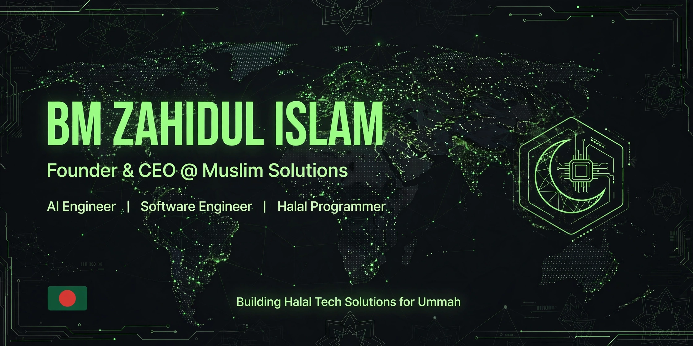

🧭 About Me

    Founder & CEO @ Muslim Solutions | AI Engineer | Software Engineer
    Principle: No haram projects and contents — Data as Amanah

Assalamu Alaikum! I'm B.M. Zahidul Islam.

My journey: Supply Chain → Enterprise Operations → Technology → Halal SaaS. After years in global supply chain and RMG operations, I turned real business pain into software.

Since 2020, building as a self-taught full-stack developer. Today I lead Muslim Solutions — an international-grade software company building reliable software that makes everyday work easier and makes worship & good deeds easier to keep.
🕌 What I'm Building

Muslim Solutions — Bringing Halal Tech Solutions for Ummah

    Our own halal platforms, and websites, web apps, and software for a person or an organization — for the good of this world and the Hereafter.

We are building a growing ecosystem of halal platforms — from Islamic finance and family tarbiyah to anonymous safe sharing and scholar consultations. Core features free, advanced tools by subscription.

And we also build custom websites, web apps, and software for individuals and organizations — from idea to launch, guided by halal principles and data as a trust.

More products are coming — this is just the beginning.
🛡️ How We Build

    100% Halal Technology — Built to Islamic principles and Shariah guidance
    International Standards — Clean architecture, modern technology, world-class development
    User Privacy First — Data is amanah, never sold or misused
    Platforms + Custom Work — Free core + subscription + custom solutions

🛠️ Tech Stack — Complete & Dynamic
🤖 AI Engineering — LLM, RAG, Agents

Core AI:
LLM
RAG
AI Agents
Prompt Engineering
Fine Tuning

Frameworks & APIs:
Python
OpenAI
LangChain
LlamaIndex
HuggingFace
FastAPI
Pandas
NumPy

Vector DB & Local AI:
Pinecone
Weaviate
Qdrant
ChromaDB
Ollama
Local AI
💻 Full-Stack Engineering — MERN + Beyond

MERN Stack (Core):
MongoDB
Express.js
React.js
Node.js

Frontend Extended:
Next.js
TypeScript
JavaScript
TailwindCSS
Redux
React Router
HTML5
CSS3

Backend & API:
REST API
GraphQL
JWT
Prisma
PostgreSQL
Firebase

DevOps, Tools & Cloud:
Docker
AWS
Git
GitHub
GitLab
Linux Mint
VS Code
NPM

Principles & Methodologies:
Clean Architecture • SOLID • System Design • Agile • CI/CD • Security by Default • Data as Amanah • Documentation First
🔒 Current Focus — Private by Design

    All my code repositories are currently private as we are in pre-launch & hiring phase. This profile page is my only public presence on GitHub.

What I'm actively building:

    Halal SaaS ecosystem at Muslim-Solutions organization — scalable, secure, privacy-first
    AI Layer: LLM-powered assistants, RAG pipelines, AI Agents for SME automation, Local AI infrastructure (Ollama + Vector DB)
    MERN Layer: Next.js + TypeScript + Node.js + MongoDB production apps with subscription, auth, and halal compliance logic
    Security hardening, branch protection, 2FA, GitLab backup mirror

Public launches coming soon — stay tuned.
📊 GitHub Analytics — 100% Dynamic (Auto-Updates)

 

    These cards update automatically — no manual editing needed when your repos grow.

✍️ Writing & Thoughts

    The Smartest Investment of 2026: Local AI System — Why sovereign AI is essential for Ummah
    Parents' Duty to Save Children from Internet — Tech as protection for Iman
    Why Learning Technology is Fard Kifayah — From Radd al-Muhtar

More on muslimsolutions.software/blog
🤝 Let's Connect
Purpose	Link
Custom software / website	Discuss a project →
Collaboration	Muslim Solutions Org →
Partnership / Hiring	info@muslimsolutions.software

 
🇧🇩 Bangladeshi Software Developer | AI Engineer | Halal Programmer | No haram projects and contents !
  

 
<i>© 2026 B.M. Zahidul Islam — Muslim Solutions — Building Halal Tech Solutions for Ummah</i>

